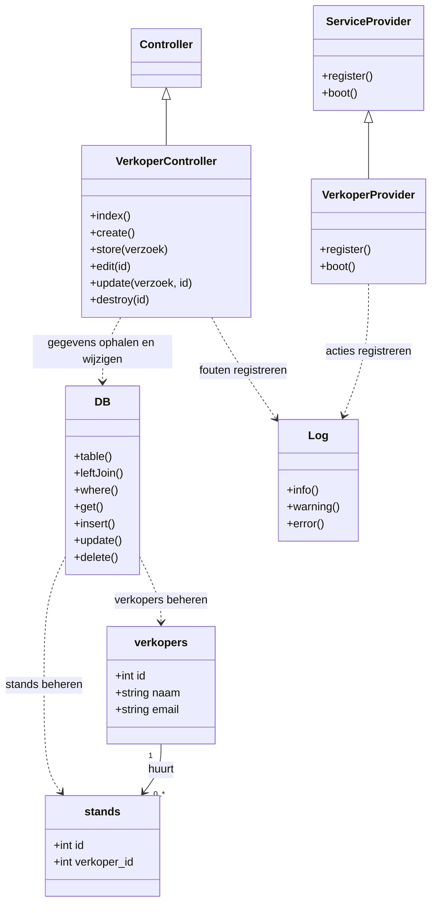

# UML-klassendiagram Verkoper – Sneakerness®

Dit klassendiagram laat zien hoe de verkoper werkt met de controller, provider, database en logging.

```mermaid
classDiagram
    direction TB

    class Controller

    class VerkoperController {
        +index()
        +create()
        +store(verzoek)
        +edit(id)
        +update(verzoek, id)
        +destroy(id)
    }

    class VerkoperProvider {
        +register()
        +boot()
    }

    class ServiceProvider {
        +register()
        +boot()
    }

    class DB {
        +table()
        +leftJoin()
        +where()
        +get()
        +insert()
        +update()
        +delete()
    }

    class Log {
        +info()
        +warning()
        +error()
    }

    class verkopers {
        +int id
        +string naam
        +string email
    }

    class stands {
        +int id
        +int verkoper_id
    }

    Controller <|-- VerkoperController
    ServiceProvider <|-- VerkoperProvider

    VerkoperController ..> DB : gegevens ophalen en wijzigen
    VerkoperController ..> Log : fouten registreren
    VerkoperProvider ..> Log : acties registreren

    DB ..> verkopers : verkopers beheren
    DB ..> stands : stands beheren

    verkopers "1" --> "0..*" stands : huurt
```
