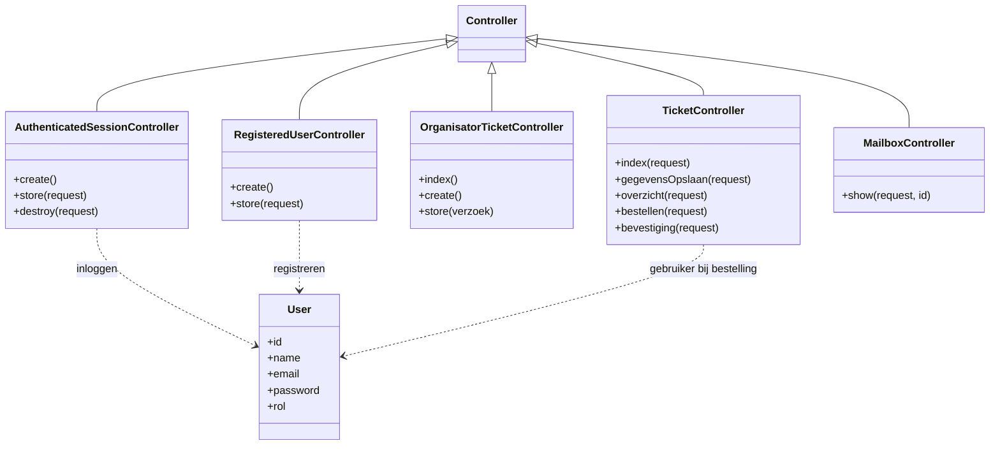

# UML-klassendiagram Sneakerness®

```mermaid
classDiagram
    direction TB

    class Controller

    class User {
        +id
        +name
        +email
        +password
        +rol
    }

    class AuthenticatedSessionController {
        +create()
        +store(request)
        +destroy(request)
    }

    class RegisteredUserController {
        +create()
        +store(request)
    }

    class OrganisatorTicketController {
        +index()
        +create()
        +store(verzoek)
    }

    class TicketController {
        +index(request)
        +gegevensOpslaan(request)
        +overzicht(request)
        +bestellen(request)
        +bevestiging(request)
    }

    class MailboxController {
        +show(request, id)
    }

    Controller <|-- AuthenticatedSessionController
    Controller <|-- RegisteredUserController
    Controller <|-- OrganisatorTicketController
    Controller <|-- TicketController
    Controller <|-- MailboxController

    AuthenticatedSessionController ..> User : inloggen
    RegisteredUserController ..> User : registreren
    TicketController ..> User : gebruiker bij bestelling
```