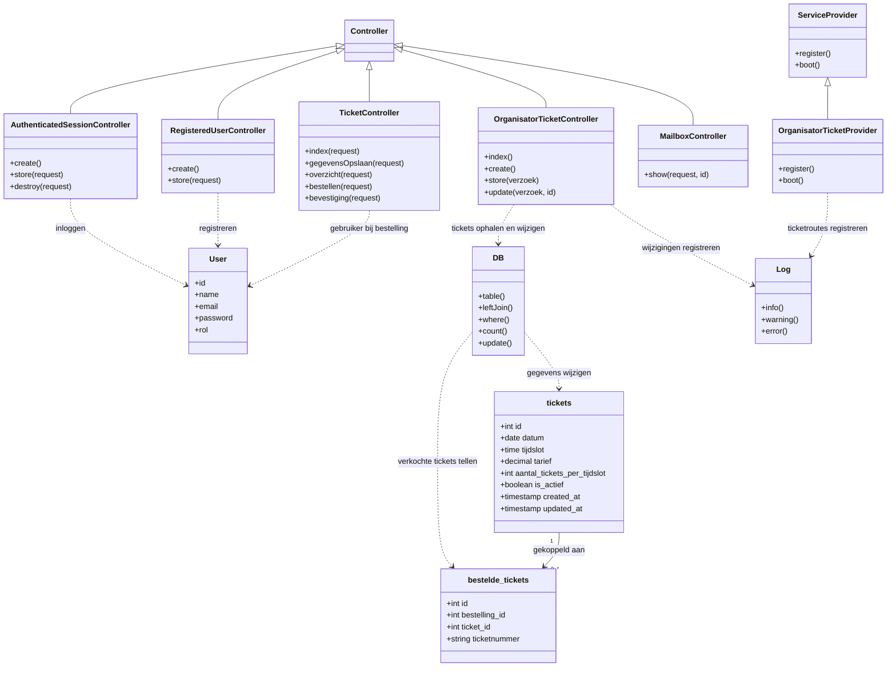

# UML-klassendiagram Sneakerness®

Dit klassendiagram laat de controllers, provider, databasebewerkingen en relaties zien.

```mermaid
classDiagram
    direction TB

    class Controller

    class User {
        +id
        +name
        +email
        +password
        +rol
    }

    class AuthenticatedSessionController {
        +create()
        +store(request)
        +destroy(request)
    }

    class RegisteredUserController {
        +create()
        +store(request)
    }

    class OrganisatorTicketController {
        +index()
        +create()
        +store(verzoek)
        +update(verzoek, id)
    }

    class TicketController {
        +index(request)
        +gegevensOpslaan(request)
        +overzicht(request)
        +bestellen(request)
        +bevestiging(request)
    }

    class MailboxController {
        +show(request, id)
    }

    class ServiceProvider {
        +register()
        +boot()
    }

    class OrganisatorTicketProvider {
        +register()
        +boot()
    }

    class DB {
        +table()
        +leftJoin()
        +where()
        +count()
        +update()
    }

    class Log {
        +info()
        +warning()
        +error()
    }

    class tickets {
        +int id
        +date datum
        +time tijdslot
        +decimal tarief
        +int aantal_tickets_per_tijdslot
        +boolean is_actief
        +timestamp created_at
        +timestamp updated_at
    }

    class bestelde_tickets {
        +int id
        +int bestelling_id
        +int ticket_id
        +string ticketnummer
    }

    Controller <|-- AuthenticatedSessionController
    Controller <|-- RegisteredUserController
    Controller <|-- OrganisatorTicketController
    Controller <|-- TicketController
    Controller <|-- MailboxController

    ServiceProvider <|-- OrganisatorTicketProvider

    AuthenticatedSessionController ..> User : inloggen
    RegisteredUserController ..> User : registreren
    TicketController ..> User : gebruiker bij bestelling

    OrganisatorTicketController ..> DB : tickets ophalen en wijzigen
    OrganisatorTicketController ..> Log : wijzigingen registreren

    OrganisatorTicketProvider ..> Log : ticketroutes registreren

    DB ..> tickets : gegevens wijzigen
    DB ..> bestelde_tickets : verkochte tickets tellen

    tickets "1" --> "0..*" bestelde_tickets : gekoppeld aan
```